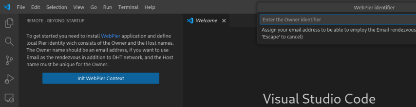
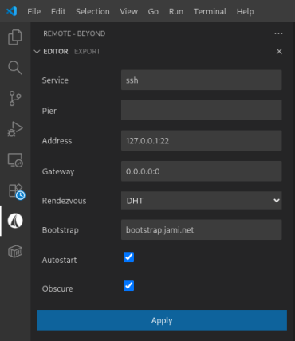

# README

The `Remote - Beyond` is a [vscode](https://code.visualstudio.com) frontend for the [WebPier](https://github.com/novemus/webpier) application. This is a means to access non-public remote services. For example, if you have a host behind the NAT and would like to use it as Dev machine, but your VPN is not fast enough, you can forward SSH of the remote host directly to the local interface by the `WebPier` with using the `Remote - Beyond`.

## How it works

The `WebPier` creates a direct UDP tunnel between the hosts and maps the remote TCP service to the local interface, or forwards the local TCP service to the remote side. UDP-hole-punching technique using STUN server is used to overcome NAT, and EMAIL or DHT services are used as a rendezvous for exchanging endpoints. No third-party servers are used to relay traffic and the tunnel is obscured by default. So it's safe. But keep in mind, for successful passage through NAT, it must implement independent policy of mapping enpoints of outcoming connections to a public interface. Fortunately, this is the most common case.

## Requirements

To use the `Remote - Beyond` extension you must install the [WebPier](https://github.com/novemus/webpier) application.

## Using

On the first start, you will be prompted to define the local *Pier* identity.

It consists from the two parts. The first one is an *Owner* identifier, which should be your email address if you want to use the EMAIL as the rendezvous service in addition to DHT. The second one is a *Host* identifier which must be unique for the *Owner*. After providing the identifiers, a pair of cryptographic keys will be generated to protect rendezvous communications. The default home directory placed in the user program directory of the `WebPier` application. You can change it in the `vscode` configuration.

You may change context settings by the `Remote - Beyond: Edit webpier context` command:

You must specify accessible STUN server, DHT bootstrap server or your email account as a rendezvous. Select *Autostart* option if you want to start `WebPier` as daemon on the system startup.

Create one or more export services on the remote machine by the `Remote - Beyond: Add export service` command:

* **Service** - the name of the service to refer it in rendezvous
* **Pier** - list of remote piers to export to or remote pier to import from the service
* **Address** - IPv4 endpoint of the exporting service or local IPv4 endpoint to import the remote service
* **Gateway** - local IPv4 endpoint for the UDP tunnel
* **Autostart** - should the service forwarding be run with the application startup or manually
* **Obscure** - should the UDP tunnel be obfuscated, must be equal for both sides
* **Rendezvous** - selector of the preferred rendezvous, must match the remote side

Since you haven't adopted any *Pier* now, leave the *Pier* field empty.

After that you have to create an *offer* for other side. Invoke `Remote - Beyond: Create an offer...` command, select your services you want to offer and save the offer file. The offer will also contain the public key of your *Pier*.

Move the *offer* to your local machine, load it by the `Remote - Beyond: Upload an offer...` command, choose from offered services that you want to import and assign addresses for them.

Now create a counter *offer* for the remote machine. Move it there and load it. And finally you must specify adopted *Pier* in the configuration of services you want to export. Once you have exchanged offers, you can configure services manually.

## Home

Home [page](https://github.com/novemus/remote-beyond) of `Remote - Beyond` extension.

Home [page](https://github.com/novemus/webpier) of `WebPier` application.

## Copyright

MIT © Novemus
